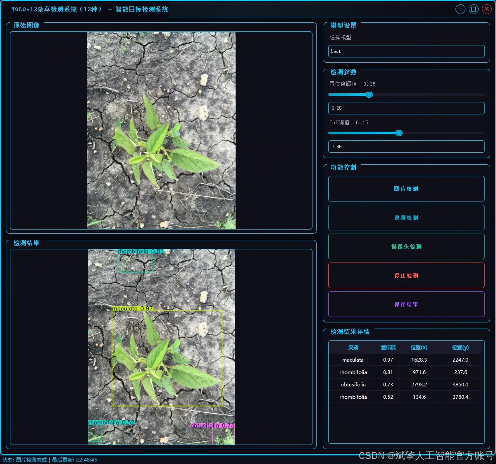
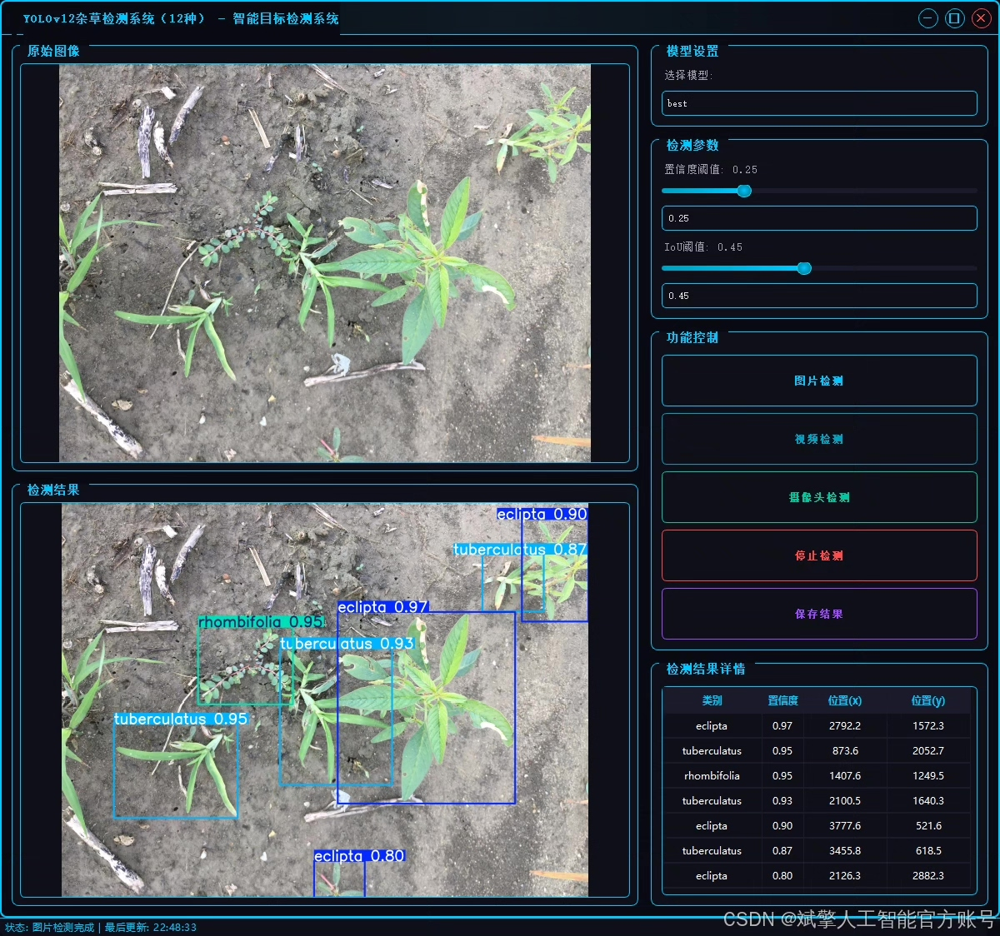
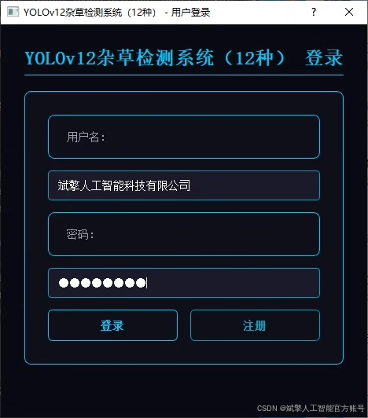
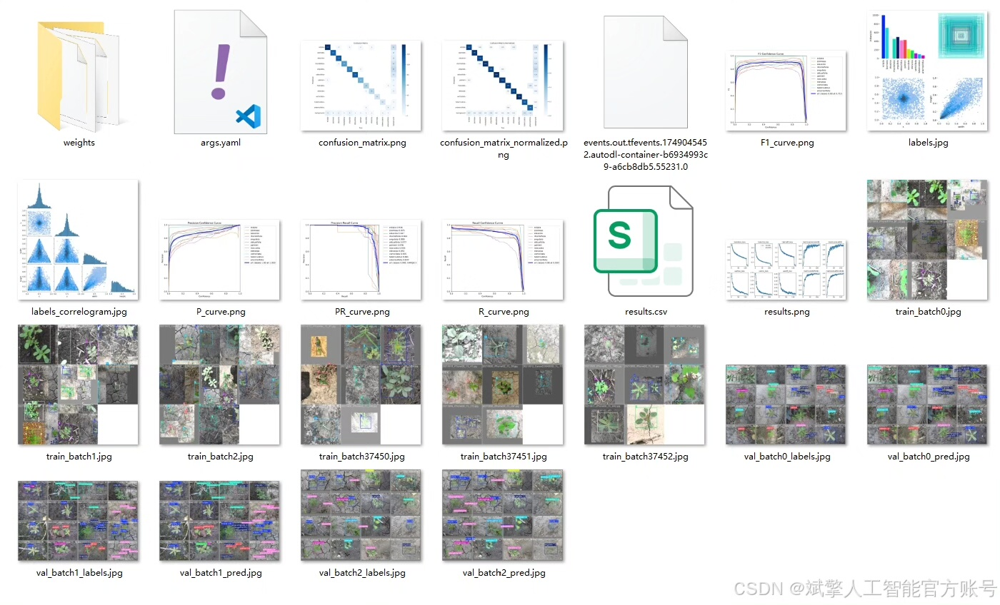
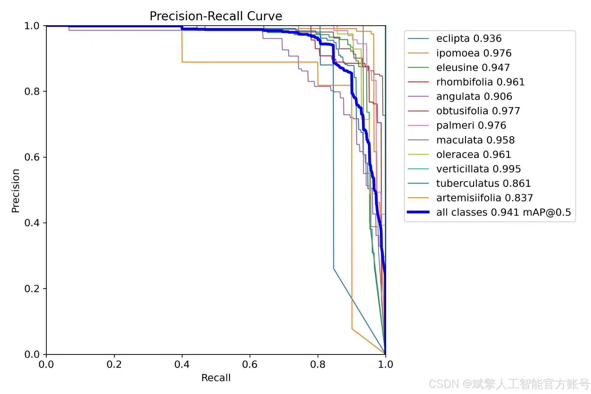
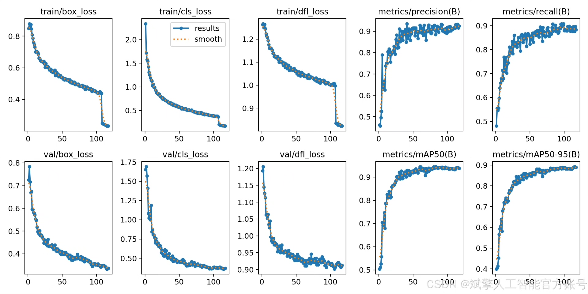
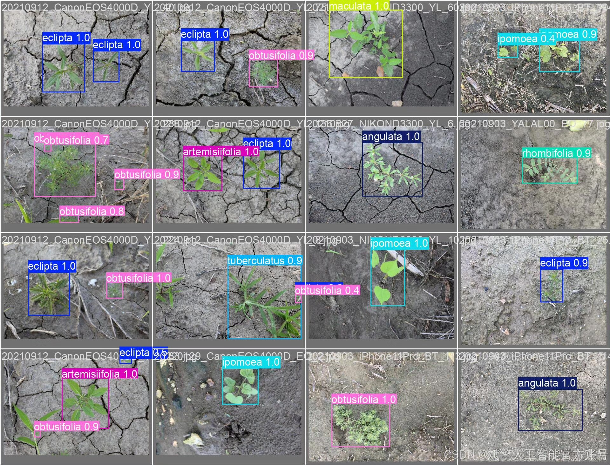
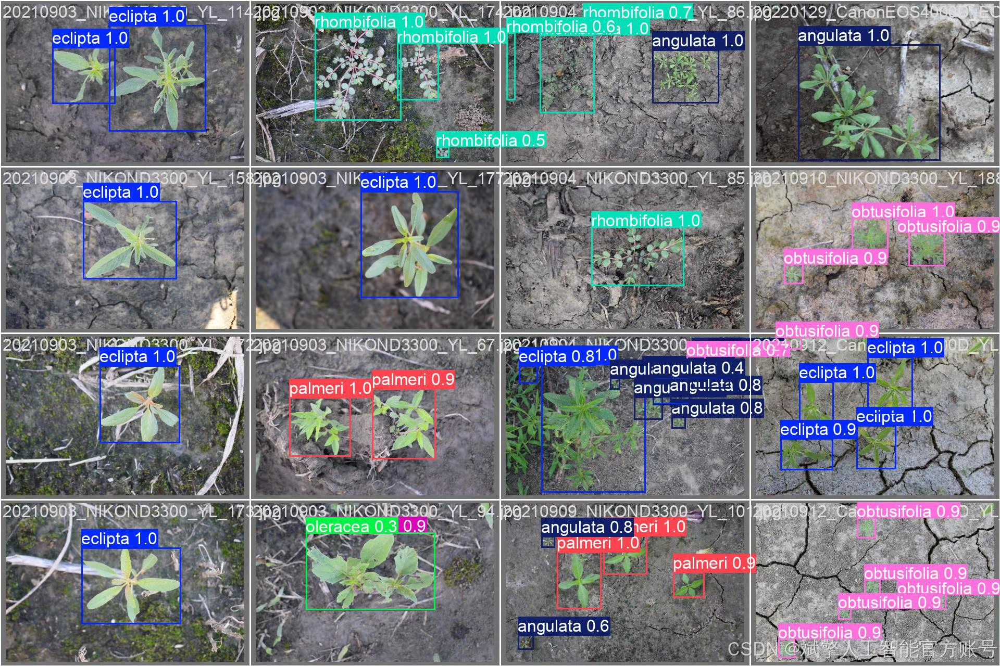

# YOLOv12 weed recognition system

## Body

YOLOv12 Weed Identification System Based on Deep Learning YOLOv12: A Weed Identification and Precision Control System (YOLOv12+YOLO dataset + UI interface + login registration interface + Python project source code + model)

In response to the demand for efficient identification and precise control of weeds in farmlands, this study has developed a weed identification and detection system based on deep learning object detection algorithm YOLOv12. The system targets 12 common weeds (such as Eclipta prostrata, Ipomoea purpurea, and Trifolium repens) and constructs a YOLO format dataset containing 2796 training images and 523 validation images. The performance of the model is optimized through data augmentation and transfer learning. The system integrates an interactive UI developed in Python, supporting user login registration, real-time detection, and result visualization. The average precision at the top of the confusion matrix (mAP@0.5) on the test set reached 94.1%. Experiments show that YOLOv12 is robust to small target weeds in complex farmland scenarios, providing an automated solution for weed management in smart agriculture.

✅ User Login Registration: Supports password verification and security validation.
✅ Three detection modes: Based on the YOLOv12 model, supports image, video, and real-time camera detection, accurately identifying targets.
✅ Dual-screen comparison: Displays the original scene and detection results on the same screen.
✅ Data visualization: Real-time table displays the category, confidence, and coordinates of detected targets.
✅ Intelligent parameter adjustment: Offers a confidence slide bar to dynamically optimize detection accuracy, adapting to different scene requirements.
✅ Sci-fi style interactive interface: Dark theme combined with dynamic light effects, reducing visual fatigue and enhancing operational experience.

## Images

## Payment

Here is a pay link on Stripe ( https://buy.stripe.com/3cs8yP7sY87d0vu9AB ). Please contact me lonlonago@foxmail.com after funding $89, and I will send you a complete data files , thank you!

